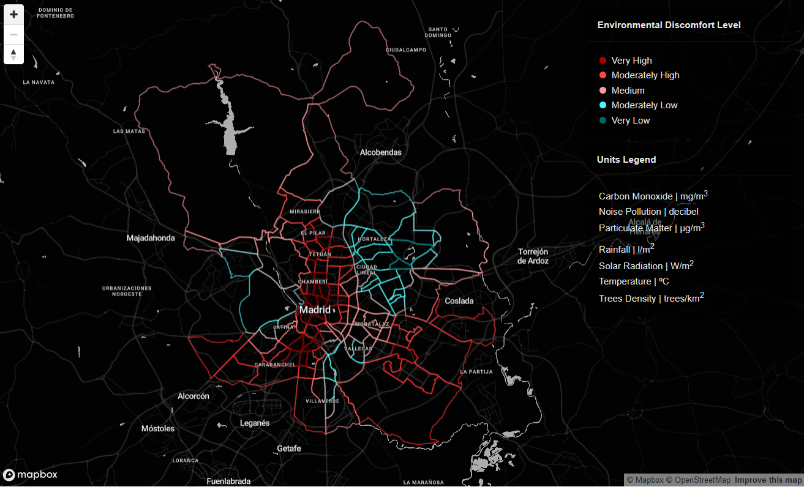
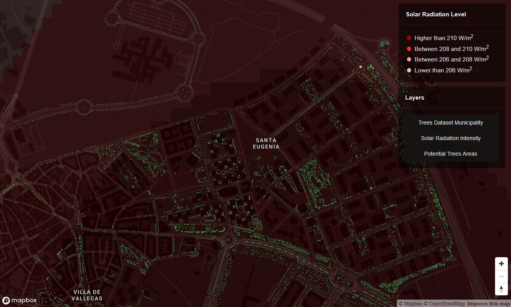

### Urban Forestry Science
### How to select optimal location for future tree canopy

##### Introduction
Trees represent a fundamental economic, social, environmental assest for our urban areas. The green canopy infrastructure provide multifaceted benefits for the planet and citizens, whether in parks or along streets.

##### Objective 
The proposal firstly identifies neighboorhoods in Madrid with the highest environmental discomfort (high particulate matter, temperature, carbon monoxide, noise pollution, etc..). Based on the mentioned criteria, it is determined a disadvantaged district and conducted a further analysis to select optimal locations for planting trees. The final goal is to provide Madrid municipality with granular metrics to evaluate the tree canopy impact on a long-term strategy.

##### Methodology 
The project strongly relies on robust statistical and mathematical approaches. The datasets are selected from the competition site as well as the Madrid open data portal. Therefore all datasets represent a verified probabilistic sample. All puctual data retrieved by monitoring stations (temperature, solar radiation, particulate matter, etc..) are homogenized performing an interpolation in quantum gis (repository here) to achieve a neighborhood detail. After selection, the datasets are normalized and aggregated using a statistical composite indicator [3], that sintethises the environmental discomfort of each district. Finally granular spatial analysis are conducted to spot optimal locations to plant trees.

Find Madrid cartography here https://iacopotesti.github.io/Urban_Forestry_Science/

Find Santa Eugenia cartography here https://iacopotesti.github.io/Urban_Forestry_Science_appendix/

